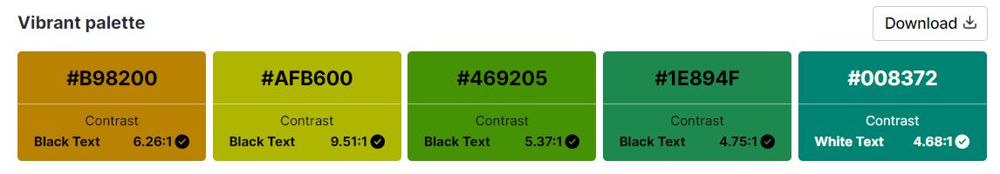
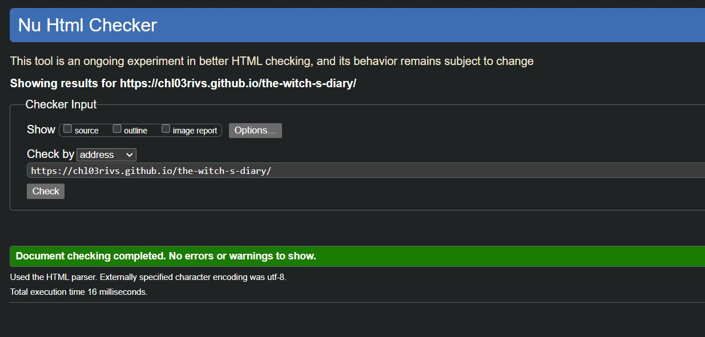
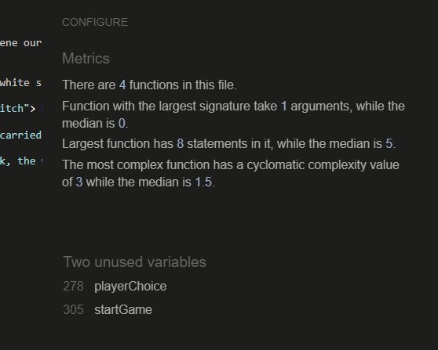

# The Witch's Diary

[View live project here on GitHub Pages](https://8000-chl03rivs-thewitchsdiar-0hl0w8w90i7.ws-eu110.gitpod.io)

The Witch's Diary is an online RPG game with a text-based, "choose your own adventure" approach.

----
## User Experience
----
The goal of this website is to provide an interactive and entertaining experience to the players.

The Witch's Diary uses themes that can be suited for young and older players alike. It aims to invite the players to remember the wonders of their own imagination and that reading can be fun also!

*First time visitor*

During their first visit, they will be greeted by the magical diary and prompted to enter or generate a name for their witch before pressing 'Play'.

The concept of the game should be easy to get and intuitive, but the welcome page presents visitors with a "help" button just in case. They can read about the rules before they proceed.

*Returning/frequent visitors*

Returning visitors can play the game as many times as they'd like to try different paths and see the other possible endings.

In order to keep visitors returning to the website/app, more challenges and difficulty will eventually be added (cf. "Future features" section).

----
##Creation Process
----
This app did not really require the design of wireframes as I wanted it to be quite simple, so the focus can be on the story-telling and the game.

The biggest part of the design-thinking was the creation of the flowchart, so our story events can make sense. I stuck with two options per obstacle/challenge to avoid a convoluted story.

----
## Design
----
### Color palette

The original colour palette was generated via the [Venngage website](https://venngage.com/tools/accessible-color-palette-generator), which also checks for the accessibility of colour pairings (following WCAG 2.1 AA based on a contrast ratio of 4.5:1).

For the sake of simplicity, I reduced the palette so it could be more minimalistic and keep the players' focus on the text.

we stick to a black background with a nice shade of green (#41FF00) for a contrast ratio of 15.52:1. This colour pairing is reminiscent of old monochrome monitors, fitting perfectly with a text-based adventure game!

###Typography
I used the [VT323 font by Peter Hull](https://fonts.google.com/specimen/VT323/tester?preview.text=The%20Witch%27s%20Diary&classification=Monospace) for this project. I liked the pixelated look of a monospace font for a retro look.

------
## Page Features
---
The website is built on a single HTML page with a header containing the game title, a body containing the game and a footer with helpful links.

The game's text content is completely generated via JavaScript and utilises the script to generate new content based on the player's choices.

----
## Future features
----
As I progress on both, my full-stack developing and my design skills, I would like to expand on this project to hopefully make it into a complete game. Once I have more knowledge and practice under my belt, here are features I would like to add:

* A life point system that actually displays a health bar or hearts for the player ♥;
* Some interactive puzzles (like sokoban games or logic problems) as challenges for a bit more engagement than choosing x or y options;
* Some "duel" games for a battle mechanic when encountering monsters (it could be as simple as a rock/paper/scissors game reminiscant of Alex Kidd, a dice rolling mechanic or more-involved quick-time events);
* Alchemy crafting workshop where the player would have gathered ingeredients on their journey and gets to drag-and-drop them into a cauldron, creating their own special potions to use later on!
* I would also want to write more story chapters and design my own characters & assets to keep things original.

----
##Technologies used
-----

* HTML
* CSS
* JavaScript

###Frameworks, libraries, technologies and programs used

* GitHub - used to save and store all of the website's files
* Git - used for version control
* Google Fonts - to import website font
* [Font Awesome](fontawesome.com/) - icons and their associated kit were downloaded from here
* [WebAIM contrast checker](https://webaim.org/resources/contrastchecker/) - to create a more accessible color palette
* Google Dev Tools - to debug and test responsiveness

-----
##Deployment
----
Github Pages was used to deploy this live website. The steps taken were as follows:

1. Log in (or sign up) to [Github](https://github.com).
2. Find the repository for this project from [my profile](https://github.com/chl03rivs) in [the-witch-s-diary](https://github.com/chl03rivs).
3. Click on the *Settings* link.
4. Click on the *Pages* link in the left hand side navigation bar.
5. In the *Source* section, choose *main* from the drop down select branch menu. 
6. Select *Root* from the drop down select folder menu.
7. Click *Save*. 
8. Your live Github Pages site is now deployed at the URL shown.

----
##Testing
----
Testing was performed throughout development using multiple devices along with the Chrome Dev Tools. I made sure to deploy the website early so I could test it on a range of devices and have a real-life impression of it.

### Testing

HTML validation

No errors were returned when passing through the [official W3C validator](https://validator.w3.org/nu):

CSS validation

No errors were found when passing through the [official (Jigsaw) validator](https://jigsaw.w3.org/css-validator/):

JS validation

No warnings or errors detected when running the JS script file through [the JSHint website](https://jshint.com):

### Issues

One of the warnings that is brought up on JSHint, regarding unused variables is not indicative of a fault in my code. The tool doesn't account for the functions being called using the "onclick" attribute on the HTML content and therefore considers the functions unusued, even though that is not the case.

In the future, I would like to avoid this by using event listeners to trigger my functions instead of the HTML attributes. Working on this project helped me see how easy it is for a script to become convoluted when you are not used to using loops as shortcuts.

---
##Credits
----
###Content references

 [Code Institute](https://codeinstitute.net) for their amazing modules on HTML, CSS and JavaScript.
* [W3Schools](https://www.w3schools.com/) for additional learning materials and tutorials, specifically:
    * [Button animation](https://www.w3schools.com/css/css3_buttons.asp#:~:text=Try%20it%20Yourself%20%C2%BB-,Animated%20Buttons,-Example);

### Media References

* [Font Awesome](https://fontawesome.com/) for all the icons used on this site.
* [Otsoga on Itch.io](https://otsoga.itch.io/free-medieval-npcs-witch-and-swordswoman) for the witch and knight assets used throughout this project.
* [Favicon.io](https://favicon.io) for the favicons used on the project.